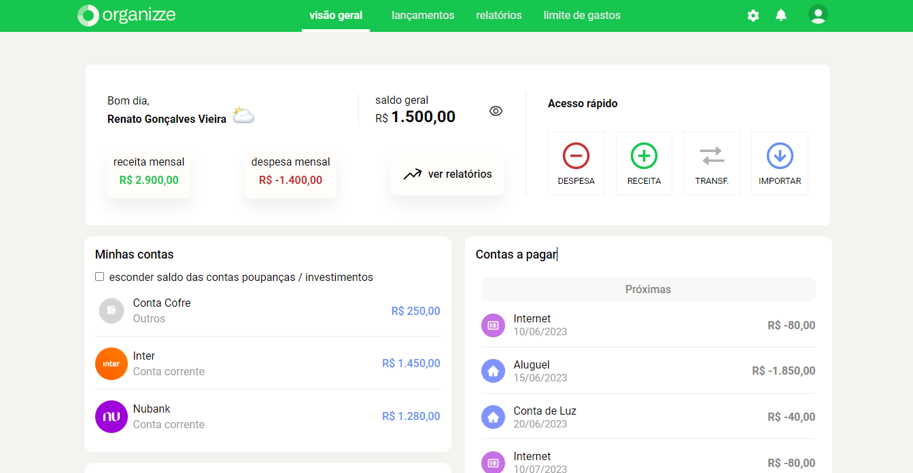

# Organizze UI Clone

Um simples clone da página inicial do dashboard da plataforma [Organizze](https://www.organizze.com.br/) feito com React para treinar os conceitos aprendidos durante o módulo de React do Curso Ignite da [Rocketseat](https://www.rocketseat.com.br/).

## Executando o projeto

### Com NPM
Execute o comando `npm run start` para rodar o projeto em modo de desenvolvimento.

### Com Yarn
Execute o comando `yarn start` para rodar o projeto em modo de desenvolvimento.

Depois abra [http://localhost:3000](http://localhost:3000) para visualizá-lo no navegador.

## Minhas Redes Sociais

Instagram - [@rgvieiraoficial](https://www.instagram.com/rgvieiraoficial/).

Linkedin - [yamirenato](https://www.linkedin.com/in/yamirenato/).